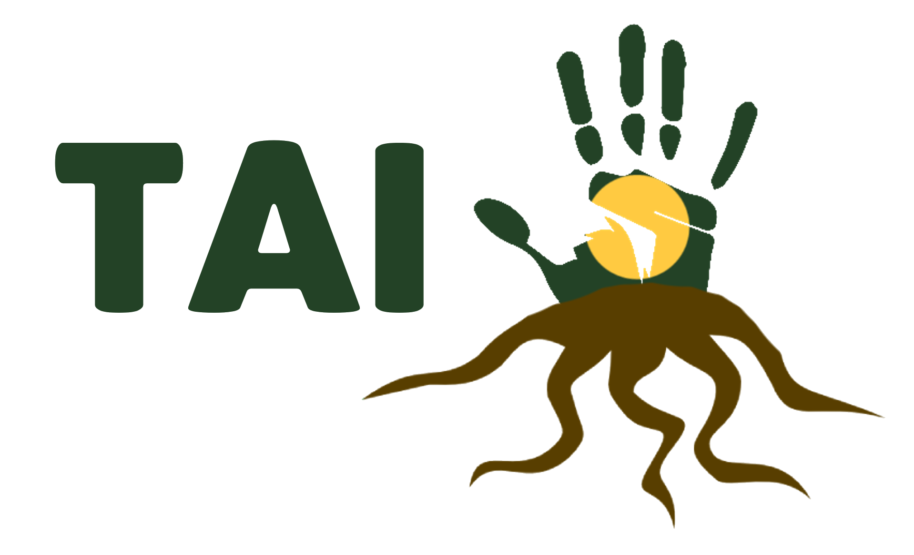

# TAI: Learning Platform for Indigenous Communitiesgit 

TAI is an advanced AI agent on a mission to empower education across multiple languages. Our focus extends beyond mainstream language support, we are committed to championing indigenous languages and addressing the unique challenges faced by indigenous communities in the educational system.



---

## Table of Contents

- [Overview](#overview)
- [Mission & Vision](#mission--vision)
- [Key Features](#key-features)
- [Impact on Indigenous Education](#impact-on-indigenous-education)
- [Installation & Usage](#installation--usage)
- [Contributing](#contributing)
- [License](#license)
- [Contact](#contact)

---

## Overview

TAI (Tutor Articial Intelligence) is designed to break language barriers and facilitate accessible, culturally relevant education. By leveraging cutting-edge agentic capabilities, TAI provides multilingual support and specialized resources tailored to diverse linguistic communities, with a special emphasis on indigenous languages that have long been marginalized.

---

## Mission & Vision

**Our Mission:**  
To empower learners worldwide by providing an inclusive educational platform that respects linguistic diversity and elevates indigenous voices.

**Our Vision:**  
We envision an education system where every learner, regardless of their native language or cultural background, has access to quality learning resources. TAI strives to create a future where indigenous languages are celebrated, preserved, and integrated into mainstream education, thereby addressing long-standing inequities and cultural disconnects.

---

## Key Features

- **Multilingual Support:**  
  Seamlessly interact with the platform in various languages, including indigenous tongues, ensuring no learner is left behind.

- **Community-Driven Improvements:**  
  Open-source contributions and community feedback help us continuously enhance TAI's capabilities, ensuring that the platform evolves with the needs of its diverse users.

- **Accessible and Inclusive Design:**  
  Prioritizing accessibility, TAI is built to cater to learners with different abilities and backgrounds.

---

## Impact on Indigenous Education

Indigenous communities face a myriad of challenges in the educational system, including:

- **Language Marginalization:**  
  Many indigenous languages have been sidelined in formal education, leading to a disconnect between learners’ cultural heritage and the curriculum.

- **Cultural Erosion:**  
  The absence of indigenous language education contributes to the gradual loss of cultural identity and traditional knowledge.

- **Resource Scarcity:**  
  There is a significant lack of quality educational materials in indigenous languages, which hinders academic progress and cultural continuity.

- **Systemic Barriers:**  
  Historical and systemic inequities have limited the opportunities for indigenous communities to access education that reflects their linguistic and cultural needs.

TAI addresses these issues by:
- Developing tools and resources that integrate indigenous languages into educational content.
- Collaborating with indigenous educators and communities to ensure cultural accuracy and relevance.
- Creating a platform that not only teaches but also preserves and promotes indigenous languages and traditions.

---

## Installation & Usage

### Prerequisites

- Deployment measures coming soon.

### Clone the Repository

```bash
git clone https://github.com/Galvanized-Heart/gen_AI_genesis_2025.git
